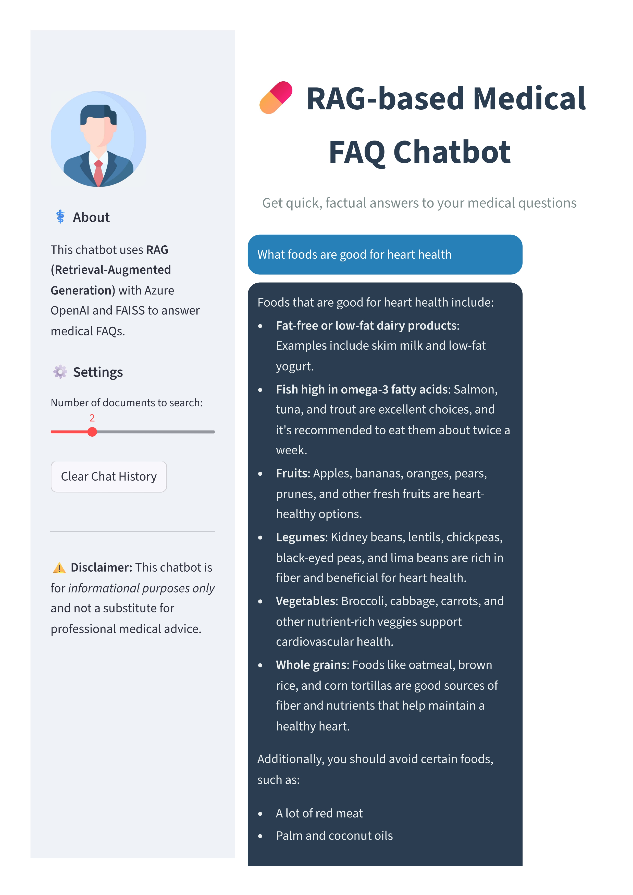

# RAG-based Medical FAQ Chatbot

This project is an advanced, conversational chatbot that uses the Retrieval-Augmented Generation (RAG) architecture to answer medical questions. It leverages a local Hugging Face model for embeddings, Azure OpenAI for language generation, and a FAISS vector store to provide accurate, context-aware, and interactive answers.

## Features

- **Conversational RAG Pipeline**: The chatbot uses a sophisticated RAG pipeline with conversational memory, allowing for natural follow-up questions.
- **Interactive Streamlit Interface**: A polished and user-friendly web interface built with Streamlit that includes a chat history, custom styling, and a sidebar for settings.
- **Hybrid Model Integration**: The project seamlessly integrates a local Hugging Face model for embeddings and a powerful Azure OpenAI model for text generation.
- **FAISS Vector Store**: A FAISS vector store is used for efficient similarity search and retrieval of medical information.
- **User-Friendly Enhancements**: Includes a "Clear History" button, configurable search settings, and a source document viewer for transparency.

## Project Structure

```
Medical_FAQ_Chatbot/
├── .env
├── app.py
├── create_vectorstore.py
├── medicalqa.csv
├── faiss_index/
├── requirements.txt
└── README.md
```

- **`.env`**: Stores the Azure OpenAI API key and endpoint.
- **`app.py`**: The main Streamlit application file.
- **`create_vectorstore.py`**: A script to create the FAISS vector store from the medical FAQ dataset.
- **`medicalqa.csv`**: The dataset of medical questions and answers.
- **`faiss_index/`**: The directory where the FAISS vector store is saved.
- **`requirements.txt`**: A list of all the Python libraries required to run the project.
- **`README.md`**: This file.

## Setup and Installation

1.  **Clone the repository**:
    ```bash
    git clone <repository-url>
    cd Medical_FAQ_Chatbot
    ```

2.  **Create a virtual environment and install dependencies**:
    ```bash
    python -m venv venv
    source venv/bin/activate  # On Windows, use `venv\Scripts\activate`
    pip install -r requirements.txt
    ```

3.  **Set up your Azure OpenAI API key**:
    -   Create a `.env` file in the project root.
    -   Add your Azure OpenAI API key and endpoint to the `.env` file:
        ```
        OPENAI_API_ENDPOINT="your-api-endpoint"
        OPENAI_API_KEY="your-api-key"
        ```

4.  **Create the vector store**:
    -   Make sure the `medicalqa.csv` file is in the same directory as the scripts.
    -   Run the `create_vectorstore.py` script:
        ```bash
        python create_vectorstore.py
        ```

## How to Run the Application

Once you have completed the setup, you can run the Streamlit application:

```bash
streamlit run app.py
```

This will open the chatbot interface in your web browser. You can then start asking medical questions.

## Screenshot



## Sample Output

You can view a sample output of the chatbot interface here:  
[📄 Streamlit Output Sample](Streamlit_Output_sample.pdf)

## Design Choices

-   **Streamlit**: Chosen for its simplicity and power in creating interactive and beautiful web applications.
-   **FAISS**: A lightweight and efficient library for similarity search, making it a good choice for this project.
-   **Hugging Face Embeddings**: A free, open-source model is used for embeddings to avoid reliance on paid services for this part of the pipeline.
-   **Azure OpenAI**: Provides a powerful and scalable language model for the generation part of the RAG pipeline.
-   **`.env` for API Keys**: This is a standard practice for securely managing API keys and other sensitive information.
